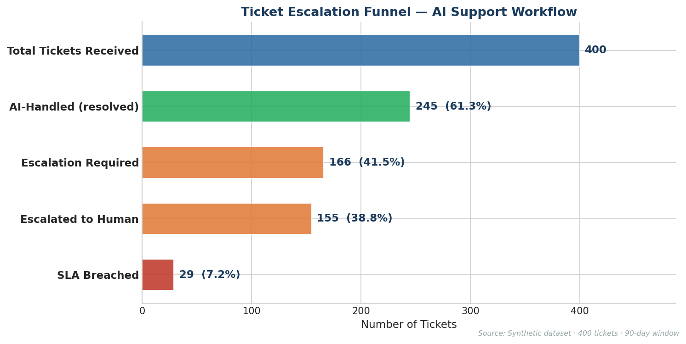
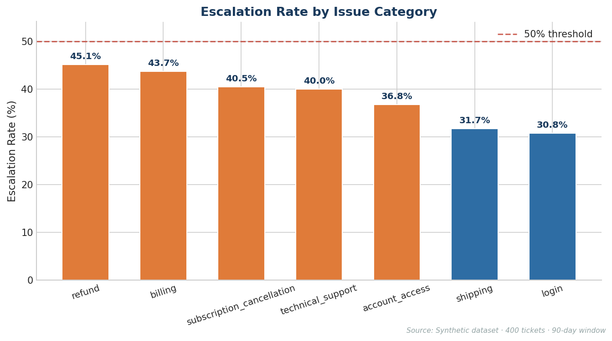
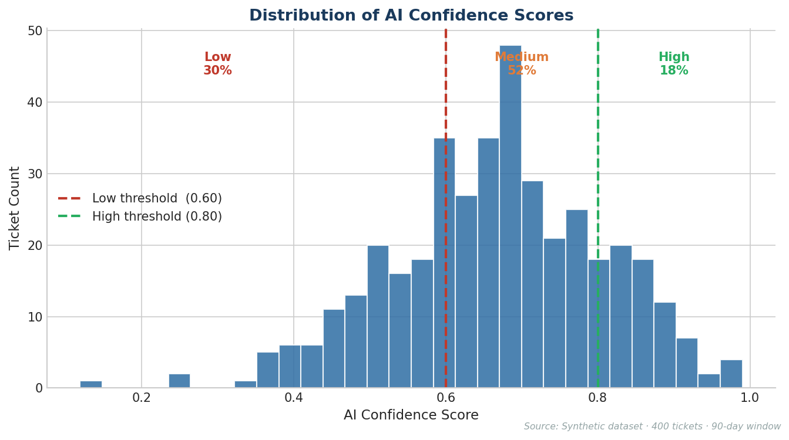
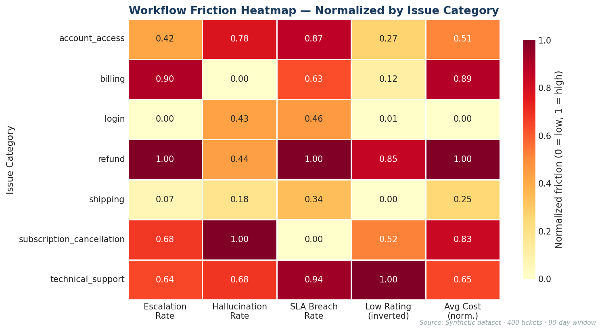
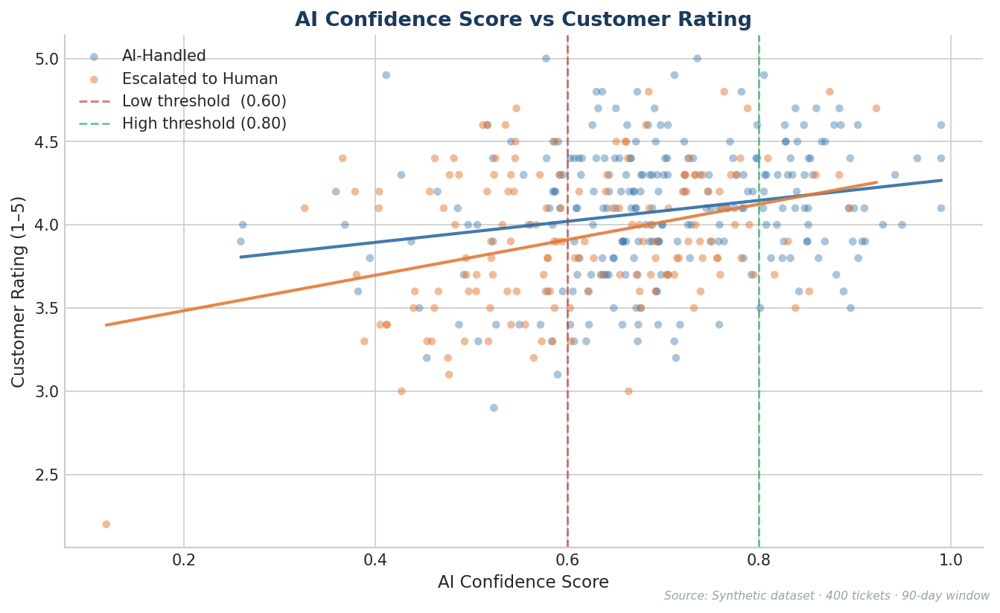
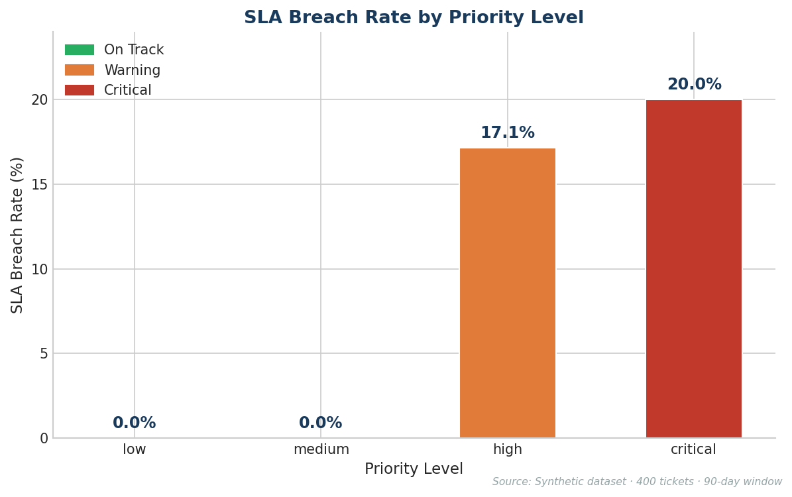

# AI Agent Workflow Observability & Performance Optimization
**Enterprise AI Support Operations Analytics**


---

## Overview

This project analyzes how AI agents perform inside enterprise customer support workflows — not the model itself, but the **operational system surrounding it**: routing decisions, escalation behavior, SLA compliance, cost tradeoffs, and customer impact.

The deliverable is a complete end-to-end analytics pipeline: synthetic data generation → cleaning → KPI computation → 10 operational visualizations → business recommendations. Every output is deterministic from a single `seed=42`.

---

## Business Problem

Companies deploy AI agents to reduce support workload and accelerate resolution times. The operational challenge is not whether AI can handle tickets — it is understanding **where it fails, how often, at what cost, and with what impact on customers.**

Without structured observability, organizations run AI systems that appear performant in aggregate while silently degrading on specific issue types, priority segments, or confidence thresholds. Low-confidence responses generate hallucinations. Misrouted tickets breach SLAs. Escalation overload increases cost and erodes customer trust.

This project builds the monitoring and analytics layer that operations teams need to govern those risks.

---

## Workflow Architecture

```
Customer submits support ticket
         │
         ▼
AI classifies issue & generates response
         │
         ▼
System evaluates confidence score
         │
         ├── High (≥ 0.80) ─────► AI handles directly  ──► Customer rating
         │
         ├── Medium (0.60–0.79) ─► Routing decision
         │
         └── Low  (< 0.60) ──────► Escalate to human  ──► Resolution
                                           │
                                           ▼
                               Operations team monitors KPIs
```

**Pipeline stages:**

| Stage | Script | Output |
|---|---|---|
| 1. Data Generation | `src/generate_data.py` | `data/raw/support_tickets.csv` |
| 2. Cleaning & Validation | `src/clean_data.py` | `data/exports/tickets_cleaned.csv` |
| 3. KPI Analysis | `src/kpi_analysis.py` | 5 Tableau-ready CSVs in `data/exports/` |
| 4. Visualization | `src/visualizations.py` | 10 PNG figures in `outputs/figures/` |

---

## Dataset

**400 tickets · 7 issue categories · 4 customer tiers · 90-day window · 25 columns**

| Column Group | Key Columns |
|---|---|
| Ticket Metadata | `ticket_id`, `customer_tier`, `issue_category`, `priority_level` |
| AI Performance | `ai_confidence_score`, `ai_correct_response`, `routing_decision`, `routing_correct` |
| Escalation & Resolution | `escalation_required`, `escalated_to_human`, `human_resolution_time_minutes`, `total_resolution_time_minutes` |
| Failure Signals | `hallucination_flag`, `failure_type`, `retry_count` |
| Customer Outcome | `customer_rating`, `repeat_issue` |
| Business Metrics | `sla_breached`, `estimated_cost_per_ticket` |

Correlations are realistic by design: technical support draws from a lower confidence distribution (~0.55 mean), hallucination probability is 4× higher at low confidence, and escalated tickets cost 3× more than AI-handled tickets.

---

## KPI Summary

| Category | KPI | Value |
|---|---|---|
| **AI Reliability** | AI Accuracy Rate | 69.2% |
| | Hallucination Rate | 4.2% |
| | Low-Confidence Rate (< 0.6) | 29.8% |
| | Routing Accuracy Rate | 86.8% |
| **Workflow** | Escalation Rate | 38.8% |
| | Avg Total Resolution Time | 30.4 min |
| | Avg Human Resolution Time | 54.7 min |
| | SLA Breach Rate | 7.2% |
| **Customer** | Avg Customer Rating | 4.02 / 5.0 |
| | Rating — Escalated | 3.93 / 5.0 |
| | Rating — AI-Handled | 4.08 / 5.0 |
| **Cost** | Avg Cost — AI-Handled | $8.49 |
| | Avg Cost — Escalated | $25.89 |
| | Escalation Cost Multiplier | **3.1×** |

---

## Dashboard Preview

| | |
|:---:|:---:|
|  |  |
|  |  |
|  |  |

*All 10 figures in `outputs/figures/`. Full KPI table at `outputs/figures/kpi_summary_table.png`.*

---

## Key Findings

**Technical support is the highest-friction category.**
Mean AI confidence of ~0.55 produces an escalation rate more than double that of login or shipping — the single largest driver of human workload and cost.

**Hallucinations compound beyond the initial failure.**
Hallucinated responses reduced average customer ratings by ~0.9 points and raised repeat-contact probability by 10 percentage points, creating downstream load invisible in first-contact metrics.

**Escalation is the dominant cost lever, not ticket volume.**
Escalated tickets cost $25.89 vs. $8.49 for AI-handled (3.1× multiplier). The escalation path accounts for ~66% of total operational cost while covering fewer than 40% of tickets.

**SLA breaches concentrate at the top of the priority stack.**
Root cause is escalation handoff latency — tickets wait in queue rather than failing on resolution speed. The fix is routing logic, not headcount.

**The confidence threshold is the most actionable control point.**
Tickets below 0.60 carry 70% escalation probability and 12% hallucination rate, versus 15% and 3% for high-confidence tickets — a direct operational lever that requires no model changes.

**Premium-tier customers absorb disproportionate SLA failures.**
Enterprise and gold-tier tickets skew high-priority. SLA breaches and hallucinations concentrate in the segments with the highest retention risk, making workflow reliability a revenue protection issue.

---

## Business Recommendations

**Route by category, not by a single global threshold.**
Technical support and account access require a higher confidence bar (≥ 0.75) before AI handles autonomously. Login and shipping can operate safely at 0.60. One threshold applied across all categories underserves the riskiest workflows.

**Implement a pre-send review gate below 0.50 confidence.**
Hallucination events are identifiable before delivery. Treating them as a post-audit metric when pre-send interception is feasible is an avoidable operational choice.

**Fix escalation routing before expanding automation.**
SLA breaches are caused by handoff latency, not resolution speed. Queue-aware routing that accounts for real-time agent availability recovers most of the critical-priority SLA gap without additional headcount.

**Monitor four KPIs weekly at the category level:** escalation rate, hallucination rate, SLA breach rate, and avg customer rating. Aggregate metrics mask category-level deterioration until it has already reached customers.

→ Full detail in [`docs/business_recommendations.md`](docs/business_recommendations.md)

---

## Project Structure

```
ai-workflow-observability/
├── data/
│   ├── raw/
│   │   └── support_tickets.csv          # Raw dataset (400 rows, 22 columns)
│   └── exports/
│       ├── tickets_cleaned.csv          # Cleaned + derived columns
│       ├── kpi_summary.csv              # One-row KPI snapshot
│       ├── by_category.csv              # Metrics grouped by issue category
│       ├── by_priority.csv              # Metrics grouped by priority level
│       ├── by_confidence_band.csv       # Metrics grouped by confidence band
│       └── escalation_analysis.csv      # Escalated vs AI-handled comparison
├── src/
│   ├── generate_data.py                 # Stage 1: Synthetic data generation
│   ├── clean_data.py                    # Stage 2: Validation, cleaning, derived columns
│   ├── kpi_analysis.py                  # Stage 3: KPI computation and CSV export
│   └── visualizations.py               # Stage 4: 10 operational dashboard charts
├── notebooks/
│   └── analysis.ipynb                   # Self-contained end-to-end analytics notebook
├── outputs/
│   └── figures/                         # 10 PNG charts at 150 DPI
├── docs/
│   ├── executive_summary.md
│   ├── business_recommendations.md
│   ├── resume_bullets.md
│   ├── linkedin_summary.md
│   └── interview_talking_points.md
├── requirements.txt
└── README.md
```

---

## How to Run

```bash
# Install dependencies
pip install -r requirements.txt

# Run the full pipeline in order
python src/generate_data.py      # → data/raw/support_tickets.csv
python src/clean_data.py         # → data/exports/tickets_cleaned.csv
python src/kpi_analysis.py       # → KPI CSVs in data/exports/
python src/visualizations.py     # → 10 charts in outputs/figures/

# Or explore interactively
jupyter notebook notebooks/analysis.ipynb
```

Full pipeline runs in under 30 seconds. All outputs are reproducible with `seed=42`.

---

## Tools

Python · NumPy · Pandas · Matplotlib · Seaborn · Jupyter · Tableau (CSV exports)
